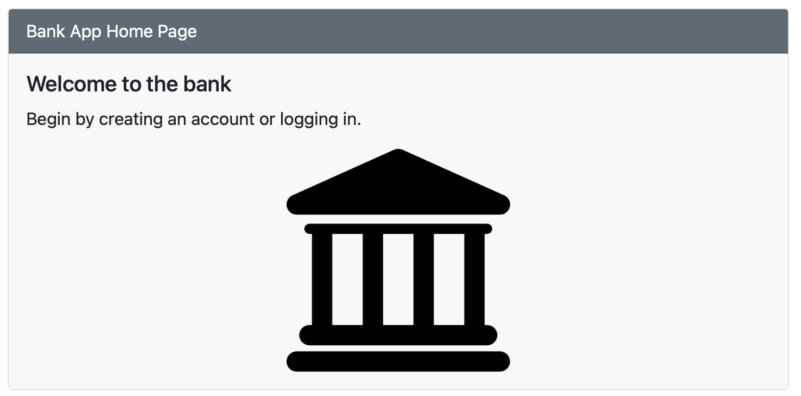
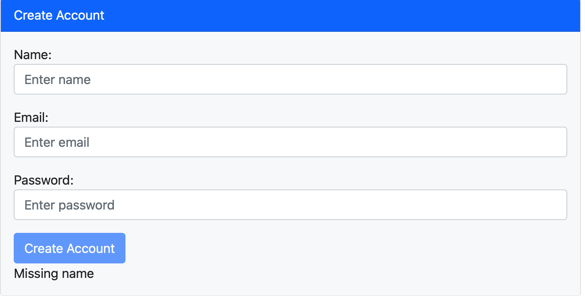

# Banking App

## Description

Final project for MIT xPRO's Professional Certificate In Coding: Full Stack Development With MERN. This project tries to replicate the functionality of a banking application and showcases the abilities learned
throughout the program to develop a full stack web application with the MERN stack.

## Installation Guide

Clone over HTTP:

    $ git clone https://github.com/luisprivas/luis-perezfullstackbankingapplication.git

## Screenshots

## Technology Used

1. MongoDB
2. Express JS
3. Node JS
4. React
5. GraphQL

## Features

1. Account creation with validation
2. Login with authentication
3. Deposit to your account (with validation)
4. Withdraw from your account (with validation)

Future features: Better UI

## License

MIT License

Copyright 2021 John Williams

Permission is hereby granted, free of charge, to any person obtaining a copy of this software and associated documentation files (the "Software"), to deal in the Software without restriction, including without limitation the rights to use, copy, modify, merge, publish, distribute, sublicense, and/or sell copies of the Software, and to permit persons to whom the Software is furnished to do so, subject to the following conditions:

The above copyright notice and this permission notice shall be included in all copies or substantial portions of the Software.

THE SOFTWARE IS PROVIDED "AS IS", WITHOUT WARRANTY OF ANY KIND, EXPRESS OR IMPLIED, INCLUDING BUT NOT LIMITED TO THE WARRANTIES OF MERCHANTABILITY, FITNESS FOR A PARTICULAR PURPOSE AND NONINFRINGEMENT. IN NO EVENT SHALL THE AUTHORS OR COPYRIGHT HOLDERS BE LIABLE FOR ANY CLAIM, DAMAGES OR OTHER LIABILITY, WHETHER IN AN ACTION OF CONTRACT, TORT OR OTHERWISE, ARISING FROM, OUT OF OR IN CONNECTION WITH THE SOFTWARE OR THE USE OR OTHER DEALINGS IN THE SOFTWARE.
